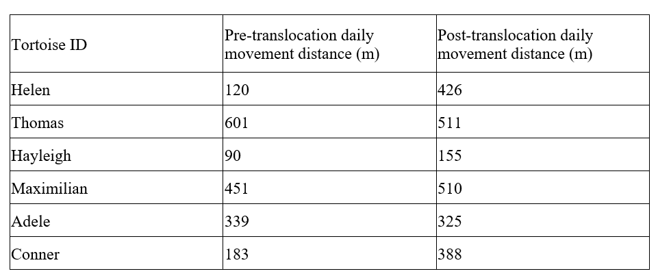

```{r setup, include=FALSE}

knitr::opts_chunk$set(
	echo = TRUE,
	message = FALSE,
	warning = FALSE,
	cache = TRUE
)
```


Today's exercises provide hands-on experience working with t-tests (and nonparametric alternatives) in R, with an emphasis on drawing valid statistical interpretations from your results. 

I encourage you to work in teams of three. This way, one team member can focus on a single problem, and then all team members can review their solution and results with other members of the team. 

Please submit your responses individually on webcampus. If you worked with a team, please include the names of your team members at the top of your submission. 

Reports must be uploaded to Webcampus by the date indicated (see WebCampus).

It is not expected that you will complete the whole process during the 50-minute class period. 

You are of course welcome to ask for help outside of your groups by using the Statistical Concepts Discussion Forum, or by asking the instructor for hints. 

Good luck!!


### Problem 1.  
Your research team is tasked with testing whether tortoises move longer distances after translocation than before translocation. You measure average daily movement distances for one month pre-translocation and one month post-translocation. Here are your data:

{width=50%}

You can copy the following code to load this into R:

```{r}
library(tidyverse)

tortdf <- tribble(
  ~ name, ~ pre_trans, ~post_trans,
  "Helen",	120,	426,
  "Thomas",	601,	511,
  "Hayleigh",	90,	155,
  "Maximilian",	451,	510,
  "Adele",	339,	325,
  "Conner",	183,	388
)

# tortdf

```


With these data, use an appropriate type of t-test to assess whether tortoises move longer distances after translocation versus before translocation. Please copy your well-commented R code into the text box entry in WebCampus. Following the code, please report: 

1. Mean difference in daily movement distance before vs after translocation
2. Confidence interval on the value computed above (you choose the confidence level) 
3. t-statistic, p-value and degrees of freedom associated with the test
4. Results from a normality test
5. Results (p-value) from an analogous nonparametric test 
6. A concise statement of what you conclude from this test, concerning how translocation of tortoises affects their daily movement. 


### Problem 2. 

Your research team is tasked with testing if a new cucumber hybrid grows bigger fruit in soil type B vs soil type A. You measure dry weight (g) for seven cucumbers grown in soil type A and 14 cucumbers grown in soil type B. Here are your data:

Soil type A: 5.5, 7.1, 2.2, 11.1, 4.73, 8.9, 5.1                       
Soil type B: 2.7, 6.1, 11.3, 3.6, 8.6, 4.4, 3.8, 9.5, 8.8, 4.5, 7.0, 12.2, 51.1, 5.2, 5.5, 3.0, 9.59 

And here are the same data in R- feel free to copy this chunk:

```{r}

typeA <- c(5.5, 7.1, 2.2, 11.1, 4.73, 8.9, 5.1)                       
typeB <- c(2.7, 6.1, 11.3, 3.6, 8.6, 4.4, 3.8, 9.5, 8.8, 4.5, 7.0, 12.2, 51.1, 5.2, 5.5, 3.0, 9.59) 

```

With these data, use a two-sample t-test to assess whether cucumbers tend to be larger when grown in one soil type versus the other (is this a one-tailed or two-tailed test?). Plot the data as relevant (e.g. using a boxplot to compare results from the two soil types). Please provide your well-commented R code and report the following:

1. Mean cucumber weight in each soil type
2. Confidence intervals on the means you computed above (you choose the confidence level)     
3. t-statistic, p-value and degrees of freedom associated with the test
4. A brief discussion of any potential outlier issue you may or may not have. Does your answer change if you remove the outlier? Why or why not? Should you remove the outlier?   
5. Run any appropriate normality tests and report the results
6. Results (p-value) from an analogous nonparametric test  
7. A concise statement of what you conclude from this test, concerning how translocation of tortoises affects their daily movement.

### Problem 3. 

Your research team is tasked with testing if first-year tree seedlings of a drought-adapted pine species characteristic of the Great Basin Desert (singleleaf pinyon pine, or *Pinus monophylla*) exhibit plasticity in biomass allocation to belowground plant tissues as a function of water availability. 

You are given data for the root:shoot ratio for 23 seedlings given an abundant water supply that is maintained at close to field capacity over the course of the growing season (i.e., “Wettest Treatment”), and for another 23 seedlings that are maintained at close to the wilting point for the entire growing season after an initial pulse of water following germination (i.e., “Driest Treatment”). The seedlings are clustered according to different source populations throughout the range of the species, but we will ignore that for purposes of this class exercise. 

It is hypothesized that seedlings grown under conditions of severe water limitation will allocate a greater proportion of carbon (hence, biomass) to their root systems, and therefore will maintain a greater root:shoot ratio. 

Import the comma-delimited Excel spreadsheet, [“ShootRoot.csv”](ShootRoot.csv), which contains only two columns of data: Treatment (Wettest vs. Driest), and Root.Shoot (the root:shoot ratio). 

```{r}

shootroot <- read_csv("ShootRoot.csv")
shootroot

```

With these data, assess whether singleleaf pinyon pine seedlings exhibit greater root:shoot ratios when grown under drier conditions. 

Please provide your well-commented R code and report the following: 

1. mean and median root:shoot ratios given both treatments
2. confidence intervals on these means
3. t-statistic and p-value for your t-test
4. assessment and discussion of whether the assumptions of t-tests were met
5. results of any alternative (e.g. non-parametric) analyses conducted as a result of violations of assumptions found in the previous step
6. your final conclusions regarding the hypothesized relationship between watering treatment and seedling plasticity with respect to root:shoot ratios. 


