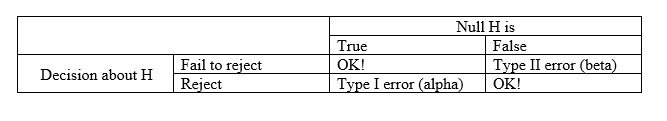

```{r setup, include=FALSE}

knitr::opts_chunk$set(echo = TRUE, cache = TRUE)

```

```{r echo=FALSE}

############################################################
####                                                    ####  
####  NRES 710, Lecture 1                               ####
####                                                    ####
####  Kevin Shoemaker                                   #### 
####  University of Nevada, Reno                        ####
####                                                    #### 
############################################################


############################################################
####  Basic Concepts of Probability and statistics      ####
############################################################


```

## Download the R code for this lecture!

To follow along with the R-based lessons and demos, [right (or command) click on this link and save the script to your working directory](LECTURE1.R)

## Overview of basic concepts of probability and statistics

We use probability to make inferences from our data!

For example, say I asked you: can people with last names beginning A-M jump higher than those with last names beginning N-Z? 

As a scientist, what would we do? 

We would want to identify, and then sample, the population of interest!

The bold line in the figure below indicates two quadrants: on the left, the unseen population of interest, and to the right, the observed sample from which we can make inference:     


**Q**: what is the population in the above example?     
**Q** what is the parameter in the above example?

**Q** what is the sample in the above example?     
**Q** what is the 'statistic' in the above example?    

*Population*: ???     
*Parameter*: ???     
*Sample*: ???     
*Statistic*: ???    

*Statistics* is about making *inference* about a population-level property (the *parameter*) from a sample.

For statistical inference to make sense, we must make several assumptions about the sample (i.e., that the sample is representative of the population).

Classical statistics involves computing a *summary statistic* from the data, and then using a (usually theoretical) 'sampling distribution' to determine whether or not that summary statistic is meaningfully different from a (usually null) hypothesis.

Where does probability come in? Well, samples are random- every sample from a population can result in a different outcome. All *summary statistics* are derived from a random sampling process. Probability helps us to quantify things that we can't know with certainty.

If all samples (and the statistics derived from them) are random, how can we be convinced that our result is *meaningful* and not simply an artifact of random sampling?

### Aside: probability

**Q**: what is the probability of getting four heads out of 4 coin flips?

We assume that heads or tails are equally likely outcomes of a single coin flip and that the four flips are completely independent.

How many possible outcomes are there?

TTTT     
TTTH     
TTHT     
TTHH     
THTT     
THTH     
THHT     
THHH     
HTTT     
HTTH     
HTHT     
HTHH     
HHTT     
HHTH          
HHHT     
HHHH     

Assuming a 'fair' coin, are each of these outcomes/sequences equally likely?

How many of the possible outcomes meet our criterion (all heads)? (How many ways are there of getting 4 heads?)

What is the probability of getting all heads?

If you get four heads in a row, are you *surprised* enough by that outcome to reject the assumption that the coin is 'fair'? What about if you got 100 heads in a row?

Probability of a specific outcome = (# ways of getting a specific outcome)/(total number of equally plausible outcomes)

**Q** What is the probability of getting at least three of the same face (heads or tails) out of 4 coin flips?

**Q** How surprised would you be to flip 4 coins and observe at least three flips with the same face??  

## Null hypotheses and p-values

The null hypothesis is simply the notion that the effect you are testing for is absent in the population of interest. 

**Q** what is the null hypothesis for the jump-height example?

The *p value* is a key concept of frequentist statistics, but one that is often misinterpreted and misunderstood. 

The p value answers the question: "what's the probability that my result (or one even more "extreme", or unlikely) could have happened by chance alone, *given the null hypothesis is true*?"

The lower the p-value, the more surprised you will be that your observed data could simply be a result of random chance under the null hypothesis AND the more likely you might be to *reject* the null hypothesis! 

### Aside: extremeness

A result 'at least as extreme as your observed result' means a result that would lend even more support for rejecting the null hypothesis than your observed result. For example, let's imagine the following scenario for the jump-height question:

Sample size: 20, 10 with names between A and M and 10 with names between N and Z.              
Observed summary statistic: mean jump-height for A-M is 0.2 cm greater than mean height for N-Z                  

**Q** Would you be comfortable rejecting the null hypothesis if random sampling under the null hypothesis yielded mean height differences of 0.2 cm or greater 20% of the time (p = 0.2)?           

### Rejecting the null

We reject the null hypothesis if the chance of the result occurring by random chance is sufficiently small. For historical reasons, 0.05 is used as the threshold (known as alpha)- if a p value is less than 0.05, we reject the null! 

Fisher proposed alpha=0.05 as a nice balance between the probability of mistakenly rejecting a true null hypothesis (Type 1 error), and the probability of failing to reject a false null hypothesis (a Type 2 error). This cutoff value was NEVER intended to be a fixed value to be applied unthinkingly!!!

Increasingly, scientists are rejecting the threshold of 0.05 and many are rejecting p-values in general. 


### Example: Fisher’s cups of tea: 

A Woman claimed she could tell if milk was added to a cup of tea first or last.

Fisher suggested we give her 8 cups of tea at once, 4 with milk first and 4 with tea first. The woman is asked to identify the four cups that were poured with milk first. 

There are 70 possible ways of choosing four cups out of 8. The probability of getting all of them right by random chance (in the null universe) would be 1/70 = 0.014 = 1.4%. That would be kinda surprising, right (in the null universe that is)? So if the lady selected all four cups correctly, are we surprised enough to reject the null?

**Q**: How would you state the null hypothesis in words?

**Q**: If we decide to reject the null, what do we now believe about our tea-taster?

**Q**: If we fail to reject the null, what do we now believe about our tea-taster? More specifically, do we now know she is a fraud?

Here are the possibilities (X=correct id, O=false id), which in the null universe are equally likely (since the lady can't actually tell the difference!). Let's assume cups 5-8 are milk first and 1-4 are milk last. The number of correct choices is in parentheses...

O1/O2/O3/O4 (0)    O1/O3/O4/X5 (1)    O1/O4/X7/X8 (2)   O2/O4/X5/X6 (2)    O3/O4/X7/X8 (2)        
O1/O2/O3/X5 (1)    O1/O3/O4/X6 (1)    O1/X5/X6/X7 (3)   O2/O4/X5/X7 (2)    O3/X5/X6/X7 (3)    
O1/O2/O3/X6 (1)    O1/O3/O4/X7 (1)    O1/X5/X6/X8 (3)   O2/O4/X5/X8 (2)    O3/X5/X6/X8 (3)    
O1/O2/O3/X7 (1)    O1/O3/O4/X8 (1)    O1/X5/X7/X8 (3)   O2/O4/X6/X7 (2)    O3/X5/X7/X8 (3)    
O1/O2/O3/X8 (1)    O1/O3/X5/X6 (2)    O1/X6/X7/X8 (3)   O2/O4/X6/X8 (2)    O3/X6/X7/X8 (3)    
O1/O2/O4/X5 (1)    O1/O3/X5/X7 (2)    O2/O3/O4/X5 (1)   O2/O4/X7/X8 (2)    O4/X5/X6/X7 (3)    
O1/O2/O4/X6 (1)    O1/O3/X5/X8 (2)    O2/O3/O4/X6 (1)   O2/X5/X6/X7 (3)    O4/X5/X6/X8 (3)    
O1/O2/O4/X7 (1)    O1/O3/X6/X7 (2)    O2/O3/O4/X7 (1)   O2/X5/X6/X8 (3)    O4/X5/X7/X8 (3)    
O1/O2/O4/X8 (1)    O1/O3/X6/X8 (2)    O2/O3/O4/X8 (1)   O2/X5/X7/X8 (3)    O4/X6/X7/X8 (3)    
O1/O2/X5/X6 (2)    O1/O3/X7/X8 (2)    O2/O3/X5/X6 (2)   O2/X6/X7/X8 (3)    *X5/X6/X7/X8 (4)*      
O1/O2/X5/X7 (2)    O1/O4/X5/X6 (2)    O2/O3/X5/X7 (2)   O3/O4/X5/X6 (2)    
O1/O2/X5/X8 (2)    O1/O4/X5/X7 (2)    O2/O3/X5/X8 (2)   O3/O4/X5/X7 (2)    
O1/O2/X6/X7 (2)    O1/O4/X5/X8 (2)    O2/O3/X6/X7 (2)   O3/O4/X5/X8 (2)    
O1/O2/X6/X8 (2)    O1/O4/X6/X7 (2)    O2/O3/X6/X8 (2)   O3/O4/X6/X7 (2)    
O1/O2/X7/X8 (2)    O1/O4/X6/X8 (2)    O2/O3/X7/X8 (2)   O3/O4/X6/X8 (2)    


**Q** what if the lady selected 3 of 4 correctly? [there are 17 ways of getting three of the four correct out of 70 total permutations]. Would you be surprised enough to reject the null hypothesis. Is it possible that you (and the lady) are living in the null universe? How surprised would you have to be to reject the null universe and admit that she can tell the difference??

ASIDE: the test above is called 'Fisher's exact test' because it literally enumerates all the possible outcomes to compute the exact probability of observing any particular outcome under the null hypothesis. Most tests we will use in this class are (necessarily) approximations that rely on certain assumptions that may or not be met in practice. Fisher's exact test assumes that all observations are independent, but otherwise makes no additional assumptions.

### Statistics Terminology: Type 1 and Type 2 errors

A type 1 error is mistakenly rejecting the null hypothesis (probability of false positive). 

A *p value* is the probability that you collect a sample in the null universe with at least as much evidence against the null (at least as much signal) than your observed data. The p-value is not a test in itself- it is only a formal test when paired with a threshold of surprise below which you are sufficiently convinced that the null hypothesis can be rejected. This threshold is called **Alpha**.  

**Alpha** is the threshold p value below which we are sufficiently convinced (surprised) that we can reject the null. We usually set the alpha level prior to performing an experiment or collecting data so we ensure a low probability of committing a type 1 error. Both an alpha level and a p-value are needed to perform a classical null hypothesis test. 

You can reject the null if *p* < alpha. Conversely you will fail to reject the null hypothesis if *p* > alpha (you are insufficiently convinced that you are NOT living in the null universe!)

A *type 2 error* is mistakenly failing to reject a false null hypothesis (you are not living in the null universe but you fail to realize it!)

**Beta** is the probability of committing a Type 2 error. 

**Q** what would it mean to set the Beta level? Why do we set alpha rather than beta?

**Q** Related question: how many universes are there where the null hypothesis is true? How about where the null hypothesis is false?    

Finally *Power* is defined as the probability of correctly rejecting an incorrect null hypothesis. Power is simply 1-Beta!

Power is influenced by sample size and effect size (signal strength in the population of interest), among other things. A *Power analysis* is an attempt to see how much power you have to detect a true signal under a given sampling design.



## Quick Review of Basic Concepts

A p value is the probability of obtaining a result at least as extreme (containing at least as much 'signal') as the observed result due to random sampling, given you are dwelling in the null universe. 

Usually the 'result' we are referring to is a single 'summary statistic' calculated from our sample and representing the amount of signal in our sample -- for example, the sample mean, the difference between two sample means relative to sampling error (as in a 2-sample t test), some other signal-to-noise ratio, or the proportion of a sample that meets some criterion (e.g., proportion red M+Ms).

This implies a multitude of potential results. Your observed result (observed test statistic) is just one of an infinite number of possible results from some sampling/measurement process. This variation across possible samples/results is called 'sampling variation' or 'sampling error'.

Imagine buying a random bag of M&Ms from a random convenience store (one of many possible bags you could buy at many possible convenience stores) and counting the proportion of red ones. There are practically countless possible samples (bags) we could get (each one potentially associated with a different proportion of reds), even though there is only one true proportion of red M+Ms in the world. Each dataset you collect is like one bag of M&Ms out a much larger population of potential bags. 

**the truth is fixed but unknown and we can only approach the truth indirectly and imperfectly via sampling**    

Now imagine we want to test the hypothesis that there are a greater proportion of red M&Ms than other five classic colors-- that is, that P(red)>(1/6). We start off by pretending we live in the null universe (first level of pretending in classical statistics), and we start collecting imaginary samples (LOTS of potential bags of M&Ms-- this is the second level of pretending!) in the null universe where reds are exactly 1/6 of the population. We then determine the probability that these simulated bags have a greater proportion of reds than our observed results (proportion of reds in our bag). This is our p-value. We use our p-value, along with our pre-determined type I error rate (threshold level of surprise we need to reject the null universe).

## Statistics: inference from a sample

Consider the following example:

Yellow-Legged frog example:    
*Population*: all yellow-legged frogs in ponds in the central Sierra Nevada     
*Parameter*: mean body size (SVL) of adult yellow-legged frogs in all ponds in the central Sierra Nevada    
*Sample*: As many frogs are captured and measured as possible in 10 ponds randomly sampled from the central Sierra Nevada   
*Statistic*: Sample mean    

Even more generally, the goal of statistics (even when not performing a test) is to infer something about a population from a sample. In the yellow-legged frog example below, there is a “true” mean body size of frogs in ponds in the central Sierra Nevada. We just don’t know what it is! After collecting the data, statistics might help use to say something about the mean body size in the population -- both about what we know AND what we don't know! 

Really, all of statistics is about dealing with uncertainty. We don't need statistics if we have complete certainty!

However, we assume that our sample mean (and many other summary statistics derived from a sample) is representative of the population. How? Why? Because of the *Central Limit Theorem*. 

## The Central Limit Theorem

The Central Limit Theorem (CLT) says that if you have a sample with a reasonably large number of observations, and each observation is randomly sampled, then the sample mean will be similar to the actual population mean: the mean of ALL yellow-legged frogs in ponds in the central Sierra Nevada (how similar? that's where the t-distribution comes in- we'll get there). And as the sample size gets bigger, the sample mean will become more representative of the true mean (it will converge on the true mean as sample size approaches infinity). 

The concept of **regression to the mean** is a natural consequence of the Central Limit Theorem!

[In-class R demo: regression to the mean]

This is useful, but that's not all. 

The CLT is the magic wand of statistics. It does enormous amounts of work for us. Why?

The CLT also implies that the distribution of sample means collected from repeated sampling is approximately normally distributed even if the underlying data themselves are not normally distributed. 

Did you ever wonder why the normal (Gaussian) distribution is so common in statistics? It's because of the CLT- many summary statistics derived from a sample are expected to have a sampling distribution that is *approximately* normally distributed (based on the CLT)!


### Example

How does this work? Let’s use the yellow-legged frog example. 

Let’s say that we could measure ALL the frogs in ALL the ponds in CA. What would that look like? 

Let’s simulate it using a log-normal distribution that is strongly right skewed (positively skewed), suggesting that there are a lot of frogs out there that are relatively small-bodied, and a few that are giants! NOTE: this is not necessarily biologically realistic, but it makes a point.  

First, let's set the population/parameter (the truth about which we hope to make inference but can never know in reality)

**Q** if we could measure the entire population of interest, do we even need statistics???


```{r}

#### ALL FROGS IN CA

allfrogs.bodysize <- rlnorm(10000,1.5,0.4)        # statistical 'population'
hist(allfrogs.bodysize,main="",xlab="SVL (mm)")   # plot out histogram

truemean_SVL <- mean(allfrogs.bodysize)           # the 'parameter'
truemean_SVL 

```


Now let's take a sample!

```{r}

mysample <- sample(allfrogs.bodysize,10)    # take sample of size 10 (10 frogs measured)
mean(mysample)   # compute the sample mean


```


And another, this time with n=20

```{r}

mysample <- sample(allfrogs.bodysize,20)    # take sample of size 20 (20 frogs measured)
mean(mysample)   # compute the sample mean


```

Since sampling is random, sampling will produce a different result every time.

To get a better picture of the sampling variance, let's sample many times!


```{r}

lotsofsamples <- list()

for(s in 1:5000){
  lotsofsamples[[paste0("sample",s)]] <- sample(allfrogs.bodysize,30)    # take sample of size 30 (20 frogs measured)
}

lotsofsamples$sample1
lotsofsamples$sample99
lotsofsamples$sample732

```

Now we can compute the sample means and the sampling variance for the summary statistic (mean body size)

```{r}

samplemeans <- sapply(lotsofsamples,mean)

hist(samplemeans,xlab="mean body size (n=30)")

```


Interesting- does this look skewed to you? Doesn't it look like a normal distribution??

It's the CLT at work!!


One way to think about this is just that there are more ways of getting a sample mean near the real mean than to get one far away from the sample mean. It doesn't matter what the raw distribution is. Of all the samples you could get, there are very few that are all at one end of the distribution. There are a lot more possible random samples that span the full distribution of values, from low to high. Take the average af all those values, low and high, and you get something in the middle. The normal distribution is humped right in the middle, because of the tendency for low and high observations to 'average out' within a sample. 

Craps example (rolling a pair of dice). There are many more ways to get 7 than to get 2!   

This works with coin flips too!

Here's the sampling distribution for the number of heads out of a single coin flip:

```{r}

hist(rbinom(10000,1,.5),xlab="N heads out of 1")

```


Now let's build up sample size and see how the sampling distribution changes. 


```{r}
par(mfrow=c(3,2))
for(i in seq(2,12,2)){
   hist(rbinom(10000,i,.5),main=paste0("sample size = ",i),xlab=sprintf("N heads out of %s",i)) 
}

```

And with really big sample size:

```{r}

hist(rbinom(10000,1000,.5),xlab="N heads out of 1")

```

## Replication and pseudoreplication

Let’s explore replication, and what it truly means. 

Make sure you read this [highly influential monograph on 'Pseudoreplication' by Stuart Hurlburt](hurlburt.pdf).  

And here's [one more paper for good measure, by Davies and Gray (2015)](daviesandgray.pdf): this is a counter to the Hurlburt article.

Clearly one of the main take-aways is: science is messy!!!

Why does science require replication?

In general, the scientific project is to discover generalizable truths. 

Q: How do we know if a result is true, and not a result of just random noise?     
    A: We use a large enough sample size so that we can convince ourselves that random noise (sampling variation) could not cause the result!
 
Q: How do we know if a result is general, and not a result of just some localized or specific phenomenon?     
    A: We draw our sample randomly from the entire population so that our sample is truly representative!
    
### Find the pseudoreplication!

*Population*: All little brown bats across the USA    
*Parameter*: Infection rate of white nose syndrome infection in cave hibernacula    
*Sample*: Two cave hibernacula in New York state.    
*Statistic*: Infection rate among sampled bats    

*Population*: All humans    
*Parameter*: Effectiveness of a coronavirus vaccine    
*Sample*: 10,000 humans sampled in Sweden    
*Statistic*: Infection rate in Uppsala (control) vs infection rate in Helsingborg (treatment)    

*Population*: all yellow-legged frogs in ponds in the central Sierra Nevada     
*Parameter*: mean body size (SVL) of adult yellow-legged frogs in all ponds in the central Sierra Nevada    
*Sample*: 3,000 frogs sampled from a single pond in the central Sierra Nevada    
*Statistic*: Sample mean


The takeaway: you can only convince yourself of the generality of a result if the sample is representative of the population. In experimental design, one way to try to ensure generality is to sample randomly from the population of interest. 

One part of the scientific endeavor is to poke at other people's research to see if it stands up to scrutiny. Even more so, we poke at in our own research. If we can convince ourselves of the truth of our results and conclusions, only then can we feel comfortable sharing the results with the scientific community. That's not out of meanness or masochism, it's out of a search for truth and generality!  

But the search for the truth is messy. In environmental science, we pseudoreplicate all the time - by necessity. For practical reasons our observations are not always completely independent from one another. 

Are we ever truly replicating perfectly and sampling sufficiently from our generalized target of inference? In many cases we are not. But that shouldn't stop us from trying to find truth- we just need to proceed with caution! 

## Assumption: all data points are independent!

Nearly all of the classical statistical analyses and tests we will go over in this class make a very important assumption -- that all data points are independent samples drawn from the population of interest. Unfortunately, truly independent data points are far from the norm in ecology and environmental science! When data points are not independent, the information content of the sample (relative to the population of interest) is reduced. Does this make sense? When we treat non-independent data points as independent we are committing pseudoreplication!

Pseudoreplication, when left 'untreated' (i.e., subjected to statistical analyses that account for sources of non-independence), can result in using statistical methods inappropriately -- mistakenly assuming that you have more information than you actually have. 

### Demo: non-independence and sampling distributions

Let's see what happens to sampling distributions with and without pseudoreplication. We are interested in testing whether mountain yellow-legged frogs in the cascade range tend to be heavier than frogs in the sierra nevada (which we know to be 1.5 g from previous studies). We take a sample of 100 individuals: 50 from each of 2 ponds. 

We assume that frogs from the two mountain ranges are the same size on average (null hypothesis is true) and that the distribution of sizes is Gaussian. However, individuals from the same pond tend to be more similar to one another than individuals sampled from other ponds. Here is the scenario: 

```{r}

# pseudoreplication demonstration

meansize.allfrogs <- 1.5    # population mean 
sdsize.allfrogs <- 0.5     # population sd
sdsize.amongpond <- 0.44   # standard deviation among ponds 

nponds <- 5000   # total number of ponds in the population
nfrogs.perpond <- 1000    # 1000 frogs in each pond


```

So we can now generate the mean sizes for all ponds in the population and all frogs within each pond 


```{r}

pondmeans <- rnorm(nponds,meansize.allfrogs,sdsize.amongpond)
 # hist(pondmeans)
allfrogs <- sapply(pondmeans, function(t) rnorm(nfrogs.perpond,t,sqrt(sdsize.allfrogs^2-sdsize.amongpond^2)) )
rownames(allfrogs) <- paste0("frog",1:(nfrogs.perpond))
colnames(allfrogs) <- paste0("pond",1:nponds)

  # confirm that population mean and standard deviation are as specified
sd(allfrogs)
mean(allfrogs)

```

Okay, now we have a population of frogs. Now we need to sample from this population!! Remember that for practical reasons we are only able to sample from 2 ponds. 

```{r}

nponds.sampled <- 2
nsamp.perpond <- 50 

ponds.sampled <- sample(1:nponds,nponds.sampled)
frogs.sampled <- replicate(nponds.sampled,sample(1:nfrogs.perpond,nsamp.perpond))

thissamp <- sapply(1:nponds.sampled,function(t) allfrogs[frogs.sampled[,t],ponds.sampled[t]])
rownames(thissamp) <- paste0("frog",1:(nsamp.perpond))
colnames(thissamp) <- paste0("pond",1:nponds.sampled)

head(thissamp)

```

Okay, now that we have collected our sample, let's run a t-test to see if the mean in our sample is different from 1.5

```{r}

test <- t.test(as.vector(thissamp),mu=1.5,alternative="greater")
test

```

Okay, we have now collected one sample from this hypothetical scenario. To generate a sampling distribution we need to generate many more samples. Let's do that now! Here we will run both a sampling scheme where we only sample 2 ponds and another sampling scheme where we sample 100 frogs randomly from the entire population. 

```{r}

means <- numeric(1000)
means.ind <- numeric(1000)

ttest <- numeric(1000)
ttest.ind <- numeric(1000)

for(scenario in 1:1000){
  ponds.sampled <- sample(1:nponds,nponds.sampled)
  frogs.sampled <- replicate(nponds.sampled,sample(1:nfrogs.perpond,nsamp.perpond))
  
  thissamp <- sapply(1:nponds.sampled,function(t) allfrogs[frogs.sampled[,t],ponds.sampled[t]])
  thissamp.ind <- matrix(sample(allfrogs,nsamp.perpond*nponds.sampled),ncol=nponds.sampled)
  
  means[scenario] <- mean(thissamp)
  means.ind[scenario] <- mean(thissamp.ind)
  
  test <- t.test(as.vector(thissamp),mu=1.5,alternative="greater")
  test.ind <- t.test(as.vector(thissamp.ind),mu=1.5,alternative="greater")
  
  ttest[scenario] <- test$p.value
  ttest.ind[scenario] <- test.ind$p.value
  
}


```

Let's look at the sampling distribution of the mean difference between male and female body mass in the null universe. Here we compare the sampling distribution for the pseudoreplicated design vs the sampling distribution for the case with 100 true independent replicates. 

```{r}

layout(matrix(1:2,nrow=1))
hist(means,xlim=c(0,3))
hist(means.ind,xlim=c(0,3))

length(which(ttest<0.05))/1000

length(which(ttest.ind<0.05))/1000

```

In the pseudoreplicated design, we have a ca. 40% chance of incorrectly rejecting the null hypothesis with nominal alpha = 0.05! With independent samples the rate is around 0.05 as it should be. 

Try running this script with less egregious pseudoreplication- e.g., with 5 ponds with 20 frogs each. How much does this improve the result??

NOTE: in the above example, the only reason pseudoreplication is a problem is that we are incorrectly assuming that the sampling distribution of our test statistic resembles the histogram on the right (independent samples). If we used the sampling distribution on the left (which correctly accounts for pseudoreplication) there would be no issue -- except that we would need to see much more extreme results in order to reject our null hypothesis! 


## Summary statistics (calculated from sample data)

We often summarize our samples by their centers (e.g., average) and possibly their spread (dispersion)    

### "Center" statistics: means, medians, geometric mean      

Sample Mean (arithmetic mean) = sum of all sampled values divided by the sample size     
Sample Median (midway point) = 50% quantile. Order the values and select the value at the center.          
Sample Geometric mean: product of numbers taken to the nth root. For two numbers, 3 and 4, you’d have the sq root of 3*4 = 3.46         

### Data spread, or dispersion: 

Sample Standard Deviation – sigma ($\sigma$) for population standard deviation, *s* for the sample standard deviation.        

Standard deviations and variances are calculated differently depending on whether we are computing these quantities for an entire population of interest vs a sample drawn from a larger population!     
The variance of a sample ($s^2$) or the variance of the population parameter ($\sigma^2$) can be computed as the square of the standard deviation. 

The variance represents the average squared difference from the mean. The standard deviation represents the square root of the average squared difference from the mean.

Standard deviation is much more commonly reported than variance because it is in the same units/scale as the original measurements.   

Coefficient of variation (cv) is the standard deviation represented as a fraction of the mean. The cv only has meaning for *ratio data*.        

#### Std deviation calculation example

For a population:  $\sigma = \sqrt{\sum_{n=1}^{i}{\frac{(x_i-\mu)^2}{N}}}$         
For a sample (estimating population variance from a sample):  $s = \sqrt{\sum_{n=1}^{i}{\frac{(x_i-\bar{x})^2}{(N-1)}}}$

For example: compute the variance of 5 numbers: 4, 3, 5, 5, 2

$\mu = (4+3+5+5+2)/5 = 3.8$

(4-3.8)^2 = 0.2^2 = 0.04       
(3-3.8)^2  = 0.64       
(5-3.8)^2 = 1.44     
(5-3.8)^2 = 1.44     
(2-3.8)^2 = 3.24     

Sum these  = 6.8     
Divide by 5  = $\sigma$ = 6.8/5 = 1.36        

For sample sd (summary statistic for population variance from a sample):    

$\bar{x}  = (4+3+5+5+2)/5 = 3.8$   

(4-3.8)^2 = 0.2^2 = 0.04       
(3-3.8)^2  = 0.64       
(5-3.8)^2 = 1.44     
(5-3.8)^2 = 1.44     
(2-3.8)^2 = 3.24      

Sum these  = 6.8      
Divide by 4  = $s$ = 6.8/4 = 1.7     


So the population sd is 1.36 whereas the sample sd is 1.7.    


#### Aside: degrees of freedom

OK, so why the different estimate of dispersion for population vs. sample? 

Which is larger? Which are we less confident in?   

This has to do with a concept called *degrees of freedom*. 

Sigma is known. Since you have the entire population measured, you can compute a measure of dispersion for the population and that measure is perfect. It is not an estimate, it is a perfect point value that is known with certainty and that represents the square root of the average squared difference from the mean. No bias, perfect precision.     

The sample standard deviation $s$, on the other hand, is an imperfect estimate of dispersion for a much larger population! 

**Q** would you expect the sample standard deviation using the first formula (pop stdev) to be biased? Why or why not?? In what direction would it be biased? 

NOTE: the formula for sample stdev *uses the sample mean*. Therefore, the sample data have already been used once to compute the standard deviation. If the true population mean was different than the sample mean, what would happen to the estimate of stdev if we replaced the sample mean with the true mean? Is it possible that the sample mean is not equal to the true mean? (of course it is!!)    

NOTE ALSO: if you know that four of the five sampled values are 4, 3, 5, and 2 AND we know that the sample mean is 3.8, we know that the final sampled data point MUST be 5. There is no *freedom* there- the data point has to be 5. Therefore, even though we have 5 data points, we have only 4 *degrees of freedom* since the sample mean is included in the formula for the estimate for sample stdev. That is, we have four independent pieces of information that we can use for computing standard deviation (we 'spent' one degree of freedom already to compute the sample mean!).  

By dividing the sum of squared deviations from the sample mean by 4 instead of 5, we are *unbiasing* the estimate of dispersion so that it is a better estimate of the population standard deviation.

## Sampling variance (variance among hypothetical sample summary statistics)

NOTE: sampling variance is NOT the same thing as the variance of a sample!

Review: we collect a random sample from a population. We want to know something about the population, but any summary statistic we compute from the sample (e.g., mean, median, variance, stdev, whatever!) will be an imperfect estimate of the true population parameter. So what do we do? How can we truly make inference about the population??

First, we need to know something about the sampling variance. We know the summary statistic will be different for every sample we collect, but *how different, really???*. How surprised should be be to get a sample statistic as or more extreme than a particular observation under the null hypothesis? What does the sample really tell us about the population of interest??

Statisticians have used probability calculus to work out the sampling distributions (often called sampling variance) for some common summary statistics. For example, the sample mean (super common summary statistic) has a theoretical sampling distribution that follows the t-distribution (N-1 degrees of freedom for a single sample) and is centered on a hypothetical value (e.g., zero under many null hypotheses, or the sample mean when you are generating a confidence interval) with dispersion described by the standard error of the mean. Let's dissect this one!  

### Standard error of the mean

Standard error of the mean = sample std deviation divided by the square root of the sample size

$se = \frac{s}{\sqrt{N}}$

The standard error of the mean is used to help us describe the sampling distribution for the sample mean (the expected dispersion of sample means if you collected thousands of new samples and computed the mean).

```{r}

#######
# Sampling distribution: the sample mean

mysample <- c(4.1,3.5,3.7,6.6,8.0,5.4,7.3,4.4)
mysample
n <- length(mysample)    # sample size
sample.mean <- mean(mysample)  # sample mean
sample.stdev <- sd(mysample)   # sample standard deviation (r uses denominator of n-1 by default!)
std.error <- sample.stdev/sqrt(n) 

std.error 

```

Now we have all the information we need to compute the sampling distribution for the sample mean. 

Our sample mean is 5.375. But if we collected different samples of size n=8, we would get different values - even if the true population mean was 5.375. What does this distribution of values look like?

```{r}

sampdist <- function(x){dt((x-sample.mean)/std.error,n-1)}
curve(sampdist,0,11,ylab="probability density",xlab="value",main="sampling distribution for the sample mean!")
abline(v=sample.mean,col="green",lwd=3)
confint <- c(sample.mean+std.error*qt(0.025,n-1),sample.mean+std.error*qt(0.975,n-1))
abline(v=confint,col="blue",lty=2)

```

The vertical blue lines indicate the *confidence interval* around the mean with the *confidence level* set at 95%. We will talk about confidence intervals a lot more, but just know that about 95% of such confidence intervals generated from random samples should include the true mean. The confidence interval helps us visualize what might happen if we repeated our sampling over and over and over- how might our summary statistic change?

Note the use of the *t distribution* in the above code block. The t distribution here represents the sampling variation that you would expect to observe around the sample mean (or an arbitrary hypothesized value) if you collected many many samples of the same size as yours (see more details below) from an unknown population. The t distribution is expressed in units of standard errors (number of standard errors above or below your hypothetical true mean). 

Just to cement this concept, let's compare the distribution above (based on a t distribution) with a brute-force simulation method!


```{r}

#######
# Sampling distribution: the sample mean #2 (brute force simulation version)

mysample <- c(4.1,1.5,3.7,6.6,8.0,4.5,5.3,4.4)
mysample
n <- length(mysample)    # sample size
sample.mean <- mean(mysample)  # sample mean
sample.stdev <- sd(mysample)   # sample standard deviation (r uses denominator of n-1 by default!)

simulated.samples <- list()
for(s in 1:10000){
  sd1 <- sqrt(sum((sample(mysample,length(mysample)-1,replace = T)-sample.mean)^2)/(length(mysample)-2))  # account for unknown standard deviation
  simulated.samples[[paste0("sample ",s)]] <- rnorm(n,sample.mean,sd1)
}
sampling.distribution <- sapply(simulated.samples,mean)

plot(density(sampling.distribution),xlim=c(0,11),ylab="probability density",xlab="value",main="sampling distribution for the sample mean!",lwd=2)    # plot the brute-force sampling distribution
hist(sampling.distribution,add=T,freq=F)
par(new=T)
curve(sampdist,0,11,xlim=c(0,11),xaxt="n",yaxt="n",xlab="",ylab="",col="red",lwd=2)  # official sampling distribution
abline(v=sample.mean,col="green",lwd=3)


```


Not a bad match right? Obviously it's easier and faster (and more accurate) to use the t distribution to approximate the sampling distribution, but I hope this helps to cement the concept!! 

NOTE: the t distribution accounts for uncertainty about the true population variance as well as the true population mean, which is why I did not just use the sample variance in the code block above (if I had, you would see that the t distribution had 'heavier tails' than the brute force distribution because it accounts for uncertainty in the sample variance and the sample mean) 

## The t statistic: signal to noise ratio for comparing 1 or 2 means

The *t statistic* (the t distribution is the theoretical sampling distribution for the t-statistic) is just another summary statistic that we can calculate from a sample. In this way it is no different from the sample mean or the standard deviation. But, since it has a simple, well described sampling variance and it involves sampling from a true population with unknown mean AND variance (which is usually the case!), it helps us to perform rigorous hypothesis tests and is therefore a very useful summary statistic!

Mathematically, *t* is the ratio of the departure of the sample mean from its hypothesized value to its standard error:

$t = \frac{(\bar{x}-\mu_0)}{s.e.}$

Let's assume that we are living in a null universe, and that our null hypothesis is that the sample mean is equal to zero. 

This is almost easier to conceptualize if we imagine a *paired* design in which, say, a set of individuals are monitored at two points in time: before a treatment and after. Let's imagine we are researching the effectiveness of a weight loss drug. We sample 25 overweight patients and weigh them before they start taking the drug and then weigh all of them 1 month after they start taking the drug. Never mind that this isn't the best drug trial design! 

So for each patient we compute the change in weight between the first and second measurements. In the null universe, the drug is not effective and we would expect the change to be no greater than expected by random chance. Our task is to convince ourselves that the results (mean weight loss across all patients) are meaningful, allowing us to break free of the null universe.

Remember:
    - the t statistic is the difference between the sample mean and some hypothesized value, standardized in units of standard error.
    - in classical null hypothesis testing, the t statistic represents the difference in standard errors between your sample mean and the hypothetical true mean (e.g., under the null hypothesis).
    - the t distribution is the sampling distribution for the t statistic.    

Here is a worked example, in R:

```{r}

## Paired t-test example:

weightloss.data <- c(-10.4,-11.6,3.9,1.5,-0.3,-3.5 -10.0,-6.7,-6.1,-2.4,-6.0,2.3,0.1,-4.1,-3.2, -11.3,-3.2,-9.3,-7.5,-5.7,-0.1,0.0,-9.8,1.0,-11.9)
hist(weightloss.data,breaks=7)
mean.weightloss <- mean(weightloss.data)
null.weightloss <- 0
stdev.weightloss <- sd(weightloss.data)
sample.size <- length(weightloss.data)
std.error <- stdev.weightloss/sqrt(sample.size)

t.statistic <- (mean.weightloss-null.weightloss)/std.error
t.statistic

curve(dt(x,sample.size-1),-5.5,2)
abline(v=t.statistic,col="green",lwd=3)

t.crit <- qt(0.05,sample.size-1)    # 'critical value' of the t statistic- you can reject the null if your value is more extreme than this!

p=pt(t.statistic,sample.size-1)    # p value
p    # this is the p value


####### Alternative: use R's built in t test

t.test(weightloss.data,alternative = "less")   # should get the same p=value!

```

**Q** Does a significant p-value here mean that everyone who takes the drug will lose weight? If not, what does it mean?

NOTE: as the df gets large, the t distribution approximates a *standard normal* distribution.

Fun fact: William Sealy Gosset – a student of Pearson, worked at Guinness brewery. He was hired to work out a way to determine the quality of stout. He published anonymously as 'Student' because Guinness prevented its employees from publishing. That's why we call it the 'Student's t-test'!

[R demo: difference between dnorm, pnorm, and qnorm]

[R demo: difference between t distribution and normal distribution]

## Confidence intervals

Confidence intervals, like p-values are super commonly used and are misinterpreted almost as often as they are used! 

Remember that in classical, frequentist statistics, the population parameter of interest is fixed- there is no uncertainty associated with the population parameter itself -- it's just that we can only collect and assess a small sample from the much larger population. So it does not make sense to say something like "the parameter has a 90% chance of falling within the confidence interval". The true parameter is either in the interval (100% probability) or it is not in the interval (0% probability). All we can say is something more like "90% of confidence intervals generated from different random samples would contain the true parameter". 

[Whiteboard example: confidence intervals]


[R demo: confidence interval for the weight loss example]

```{r}

### confidence interval for weight loss data

# summary(weightloss.data)
# 
# mean.weightloss    # mean weight loss
# std.error          # standard error of weight loss

curve(dt(x,sample.size),-4,4,xaxt="n",xlab="weight loss",ylab="probability density")
axis(1,at=seq(-4,4,2),labels = round(mean.weightloss+std.error*seq(-4,4,2),1) )
abline(v=0,col="blue",lwd=3)

t.crit <- qt(0.975,sample.size-1)    # for 95% confidence interval

abline(v=-1*t.crit,col="red",lty=2)
abline(v=1*t.crit,col="red",lty=2)

lower.bound <- mean.weightloss - t.crit*std.error
upper.bound <- mean.weightloss + t.crit*std.error

lower.bound

upper.bound

```


[quick discussion: define the confidence interval in the context of the weight loss example]

## Other statistics and sampling distributions

Pretty much all of classical null hypothesis testing works this way. We compute summary statistics from data that have well-described sampling distributions under the null hypothesis. We climb into the null universe and, using this known sampling distribution, we inquire whether or not our summary statistic (computed from our sample data) could have been a result of random sampling error in the null universe. If not (if $p\le\alpha$) then we are sufficiently surprised to reject the null hypothesis.

For example, here is another common test:

### Chi-square goodness-of-fit test.

This test asks the question “do the observations sort into categories according to your (usually null) hypothesis?”

Karl Pearson – Founded the first statistics dept, was a socialist and social Darwinist… and became a eugenicist.    

*Example*: Are grad students more likely to be born some months versus other months?

**Q**: what is the statistical population? Parameter? Sample? Statistic? 

#### Assumptions

* Response variable and predictor variable must be *categorical* (data can be summarized as contingency table)         
* Samples must be independent (this is almost always an assumption of our classical statistical tests)   
* Sampled must be representative of the population of interest (again, this is always a key assumption)   
* There must be a sufficient sample size such that the *expected number of observations* in each element of the contingency table is at least 5! 

The Chi-squared statistic is computed from the data. The sampling distribution for the statistic is called the *Chi-squared distribution*. 

#### The Chi-squared statistic:   

$\chi^2 = \sum_{i=1}^k\frac{(x_i-exp_i)^2}{exp_i}$

Here, $exp_i$ is the expected number of observations in category i under the null hypothesis. $x_i$ is the observed number in category i. So the Chi-squared statistic basically summarizes the degree to which the number of observations disagree with the expected number of observations across all categories. 

Why is the numerator squared? First, this makes all deviations positive- negatives and positives can't cancel each other out. Second, it allows us to use the well-described Chi-squared distribution!


#### The Chi-squared distribution

The Chi-squared distribution is described (like the *t* distribution) by a certain degrees of freedom ('degrees of freedom' is the *parameter* needed to describe the distribution -- just like mean and standard deviation are parameters of the normal distribution). 

If you are performing a goodness-of-fit test, the degrees of freedom for this test is one less than the number of categories.

If you are performing a test for independence of two categorical variables, the degrees of freedom is computed as $(r-1)(c-1)$ where r and c are the number of categories in each of the two categorical variables, respectively.


#### Example in R

```{r}

## Chi squared goodness-of-fit example

birthdays.bymonth <- c(40,23,33,39,28,29,45,31,22,34,44,20)
months <- c("Jan","Feb","Mar","Apr","May","Jun","Jul","Aug","Sep","Oct","Nov","Dec")
names(birthdays.bymonth) <- months

sample.size <- sum(birthdays.bymonth)
k = length(birthdays.bymonth)   # number of categories (months)
exp.birthdays.bymonth <- sample.size*rep(1/k,times=k)   # compute the expected number under the null hypothesis.

Chisq.stat <- sum((birthdays.bymonth-exp.birthdays.bymonth)^2/exp.birthdays.bymonth)
Chisq.stat


## View the summary statistic along with its sampling distribution under the null hypothesis

curve(dchisq(x,k-1),0,75)
abline(v=Chisq.stat,col="green",lwd=3)

p <- 1-pchisq(Chisq.stat,k-1)
p


### use R's built in chi squared function

chisq.test(birthdays.bymonth)     # should get the same p value!


```


### Z-tests

The Z-test is a simpler version of the t-test for when sample size is large enough so that we don't really need the t distribution anymore (n>50) or if the population dispersion is known (in which case we can assume the sample mean is normally distributed, following the CLT). 

The Z statistic is:

$Z = \frac{(\bar{X}-\mu_0)}{s.e.}$

As you can see, this looks very much like the t statistic! Actually it is exactly the same! The difference is that we are now assuming that the sampling variation for this statistic is normally distributed instead of t-distributed, so we now call it the Z statistic! 

#### Example z-test: Golden State Warriors height

Tall basketball players are often successful. The Golden State Warriors are often successful. How tall are the Golden State Warriors relative to other basketball players in the NBA? We hypothesize that GSW players are taller than the NBA average! The null hypothesis is that they are essentially randomly sampled from the general pool of NBA players. 

What is the Population? Parameter? Sample? Statistic? 

The GSW are 15 players with an average height of 6’8” (80”). 
A large survey of NBA players suggests they are, on average, 6’7” tall (79") with a standard deviation of 4 inches.

NOTE: the z-test is only appropriate here because we know the population standard deviation. If this is the case, we know under the CLT that the sample means should follow a normal distribution. (the only reason the t-distribution differs from the normal distribution is that we also are estimating the sample standard deviation- it is not known with certainty!). 

NOTE: B. Sullivan obtained those values from research into the height of NBA players. 


Here, the mean (mu) and the standard deviation (q) are coming from the population (all NBA players) instead of the sample. There are situations where you can use the sample standard deviation to compute standard error for a Z test, but those should be only when the sample size is very large. In general you should use a t-test when the population standard deviation is unknown. 


Use this link to download the data for this example: [link to GSW data](GSW_height.csv)

```{r}

## Z test  (Ben Sullivan example)

df <- read.csv("GSW_height.csv")
GSWheight <- df$Height
GSWheight
mean.gsw <- mean(GSWheight)
sd.gsw <- sd(GSWheight) 
sd.pop <- 4
mean.pop <- 79
n <- length(GSWheight)
s.e. <- sd.pop/sqrt(n)

null.height <- mean.pop   # null: GSW are sampled randomly from the pool of all NBA players. They are not fundamentally different!

z.statistic <- (mean.gsw-null.height)/s.e.
z.statistic

curve(dnorm(x),-3,3)    # we assume that the z statistic is normally distributed- standard normal!
abline(v=z.statistic,col="green",lwd=3)

p <- 1-pnorm(z.statistic)    # is the p value enough evidence to tell you that GSW players are taller than the NBA average??
p       

pnorm(z.statistic)

```

**Q** That means that 74% of NBA players are shorter than the GSW average height, right?

Wrong- that means that 74% of samples of 15 players drawn randomly from the population of NBA players would have a mean height less than or equal to the mean height of the GSW players. Conversely 26% of samples would have a mean height greater than that of the GSW team (that's the p value). 

**Q** So can you reject the null hypothesis and say that the GSW team is taller than expected by random chance?


[Group questions: (1) for any normal distribution (e.g., the standard normal or z distribution) what is the probability of obtaining a random number within 1 standard deviation of the mean?  (2) for any normal distribution (e.g., the standard normal or z distribution) what is the probability of obtaining a random number within 2 standard deviations of the mean?  (3) what is the 95% quantile of the standard normal distribution (z distribution)?

### F tests (ANOVA, regression)

We will get there in a couple weeks! Hang tight! Just know that the F statistic is another test statistic you can compute from your sample, and the F distribution is another sampling distribution that has been worked out by our statistical forebears!


## Probability distributions- the basics (and how to use them in R)

### Discrete vs. continuous
In *discrete distributions*, each outcome (value that could be sampled under this probability distribution) has a specific *probability mass* (like the probability of flipping a coin 10 times and getting 4 heads). For example, let's consider the Poisson distribution:  

```{r}

#################
# Discrete probability distributions

mean <- 5
rpois(10,mean)    # note: the random numbers sampled from this distribution have no decimal component

             # plot discrete probabilities of getting particular outcomes!
xvals <- seq(0,15,1)
probs <- dpois(xvals,lambda=mean)
names(probs) <- xvals
               
barplot(probs,ylab="Probability Mass",main="Poisson distribution (discrete)")

barplot(cumsum(probs),ylab="Cumulative Probability",main="Poisson distribution (discrete)")   # cumulative distribution

sum(probs)   # just to make sure it sums to 1!  Does it???

```

In *continuous distributions*, each possible value/quantity that could be randomly sampled is associated with a *probability density*, $f(x)$, not probability mass $Prob(x)$. This is because the probability of getting any particular value in a continuous distribution is effectively zero. This arises from the problem of precision. The sum of the probability distribution must be 1 (there is only 100% of probability to go around). In a continuous distribution, there are an infinite number of possible values of x. So any individual probability is always divided by infinity, which makes it zero. Therefore we have to talk about probability density, unless we want to specify a particular range of values – we can’t calculate $Prob(x = 5)$, but we can calculate $Prob(4 < x < 6)$ or $Prob(x > 5)$. The probability density is defined as the probability of getting a value within an infinitesimally small range of a particular value, divided by that infinitesimally small interval. No worries if you don't understand that - you can just think of probability density as the relative likelihood of sampling one value versus another. Let's consider the beta distribution: 

```{r}

#########
# continuous distributions

shape1 = 0.5
shape2 = 0.5

rbeta(10,shape1,shape2)   # generate 10 random numbers from a continuous distribution

curve(dbeta(x,shape1,shape2),ylab="probability density",xlab="possibilities")   # probability density function (PDF)

curve(pbeta(x,shape1,shape2),ylab="cumulative probability",xlab="possibilities")   # cumulative distribution

integrate(f=dbeta,lower=0,upper=1,shape1=shape1,shape2=shape2)    # just to make sure it integrates to 1!!

```


### Parameters and parametric statistics

**Parameters** are the arguments used to describe probability distributions - they describe the exact shape and location of the distribution. Different distribution families are associated with different parameters. For example, the normal distribution is described by 2 parameters: mean and stdev. The Poisson distribution has only one parameter (the mean). The binomial distribution is described by 2 parameters: size (number of trials) and prob (success probability for each trial).  

*Parametric statistics* require assuming certain things about distributions & parameters, while *nonparametric statistics* do not require these assumptions. NOTE: nonparametric statistics still usually make the assumption that observations are independent!

**Q** Given the CLT makes many classical tests robust to non-normal data distributions, why do we need non-parametric statistics? 

### Probability distributions in R

#### Random number generators

**Random number generators** are functions for generating random values from a specified probability distribution (e.g., 'rnorm', 'rpois', 'rt')

```{r}

# random number generators

rnorm(10)    # generate 10 random numbers from a standard normal distribution
rnorm(5,25,5)  # generate 5 random numbers from a normal distribution with mean=25 and sd=5
rpois(8,18)  # generate 8 random numbers from a poisson distribution with mean=18

```

#### Probability density functions

Continuous distributions are associated with **PDFs**, or probability density functions (e.g., 'dnorm','dt','dgamma'). These functions give you the probability density (relative probability) of any particular value/quantity that could be randomly sampled under this distribution.  

```{r}

## probability density function example 

curve(dt(x,8),-4,4,xlab="possibilities",ylab='relative probability (prob density)')

```
#### Probability mass functions

For discrete distributions, **PMFs** - Probability mass functions (e.g., 'dpois','dbinom') -- give you the exact probability of obtaining any particular value that could be sampled under this distribution. 

```{r}

## probability mass function example 

x <- barplot(sapply(0:10,function(t) dpois(t,2)),xlab="possibilities",ylab='probability')
axis(1,at=x,labels=0:10)

```

#### Cumulative distribution function
For continuous AND discrete probability distributions, **CDFs** - Cumulative distribution functions (e.g., 'pnorm','pt','pchisq','pbinom','ppois') give you the probability of obtaining a value less than or equal to any particular value that could be sampled under the distribution.

```{r}

## cumulative distribution function  

    # for continuous distribution
curve(pt(x,df=8),-4,4,xlab="possibilities",ylab='cumulative probability')

    # for discrete distribution
x <- barplot(sapply(0:10,function(t) ppois(t,2)),xlab="possibilities",ylab='cumulative probability')
axis(1,at=x,labels=0:10)

```

#### Quantile functions

**Quantile functions** - inverse of CDF- give you the values below which a specific percent of random samples should fall (e.g., 'qnorm','qt','qpois','qchisq'). The quantile function is the inverse of the cumulative distribution function.

```{r}

## quantile function  

    # for continuous distribution
curve(qt(x,df=8),0,1,xlab="cumulative probability",ylab='quantile')

    # for discrete distribution
curve(qpois(x,4),0,1,xlab="cumulative probability",ylab='quantile')

```

### Moments

**Moments** are important descriptors of a distribution. The collection of all the moments (of all orders, from 0 to infinity) uniquely determines the shape of the distribution.  

* The zeroth central moment ($\int \left ( x-\mu  \right )^{0}Prob(x)\partial x$) is the total probability (i.e. one),  
* The first central moment ($\int \left ( x-\mu  \right )^{1}Prob(x)\partial x$) is $\mu - \mu = 0$.   
* The second central moment ($\int \left ( x-\mu  \right )^{2}Prob(x)\partial x$) is the variance.    
* The third central moment ($\int \left ( \left (x-\mu   \right )/\sigma  \right )^{3}Prob(x)\partial x$) is the skewness.     
* The fourth central moment is the kurtosis. 

### Some common probability distributions  
Here are some common probability distributions. Pay particular attention to the type of *process* described by each distribution. The key to using these distributions to represent random variables is to figure out which statistical process best matches the ecological process you’re studying, then use that distribution. e.g., am I counting independent, random events occurring in a fixed window of time or space (like sampling barnacles in quadrats on an intertidal bench)? Then the distribution of their occurrence is likely to follow a Poisson or Negative Binomial distribution.


#### Binomial
```{r}

##########
# Binomial

size <- 10
prob <- 0.3
rbinom(10,size,prob)

xvals <- seq(0,size,1)
probs <- dbinom(xvals,size,prob)
names(probs) <- xvals
               
barplot(probs,ylab="Probability",main="Binomial distribution")

barplot(cumsum(probs),ylab="Cumulative Probability",main="Binomial distribution")   # cumulative distribution

sum(probs)   # just to make sure it sums to 1!  Does it???

```


#### Normal
```{r}

#########
# Gaussian (normal)

mean = 7.1
stdev = 1.9

rnorm(10,mean,stdev)

curve(dnorm(x,mean,stdev),0,15)   # probability density

curve(pnorm(x,mean,stdev),0,15)   # cumulative distribution

integrate(f=dnorm,lower=-Inf,upper=Inf,mean=mean,sd=stdev)    # just to make sure it integrates to 1!!


```


#### t distribution

```{r}

#########
# t distribution

df = 6

rt(10,df)     # random numbers from the t distribution

curve(dt(x,df),-4,4)   # probability density

curve(pt(x,df),-4,4)   # cumulative distribution

integrate(f=dt,lower=-Inf,upper=Inf,df=df)    # just to make sure it integrates to 1!!


```


#### Chi-squared distribution


```{r}

#########
# Chi-squared distribution

df = 6

rchisq(10,df)     # random numbers from the chi squared distribution

curve(dchisq(x,df),0,15)   # probability density

curve(pchisq(x,df),0,15)   # cumulative distribution

integrate(f=dchisq,lower=0,upper=Inf,df=df)    # just to make sure it integrates to 1!!


```


#### Exercise (optional):

Visualize (in R) the following distributions as above: Gamma, Exponential, Lognormal, Negative Binomial.


[--go to next lecture--](LECTURE2.html) 


