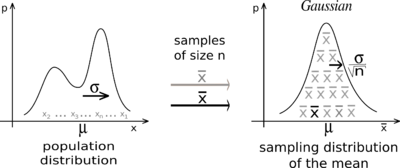
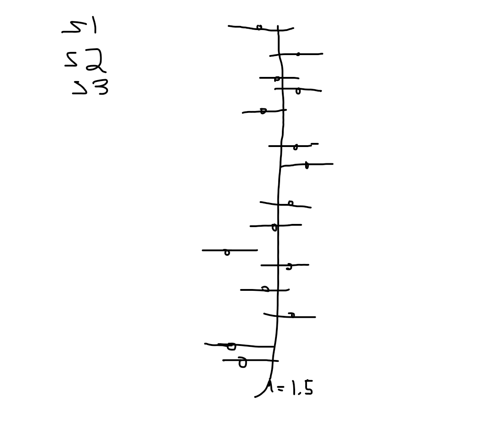

```{r setup, include=FALSE}

knitr::opts_chunk$set(
	echo = TRUE,
	message = FALSE,
	warning = FALSE,
	cache = TRUE
)
```

```{r echo=FALSE}

##  NRES 710, Lecture 2                               
##    University of Nevada, Reno                       
##    Sampling distributions                                      

```


## Download the R code for this lecture!

To follow along with the R-based lessons and demos, [right (or command) click on this link and save the script to your working directory](LECTURE2.R)

## Statistics: inference from a sample

{width=40%}

Consider the following example:

Yellow-Legged frog example:    
*Population*: all yellow-legged frogs in ponds in the central Sierra Nevada     
*Parameter*: mean body size (SVL) of adult yellow-legged frogs in all ponds in the central Sierra Nevada    
*Sample*: As many frogs are captured and measured as possible in 10 ponds randomly sampled from the central Sierra Nevada   
*Statistic*: Sample mean    

{width=40%}

The goal of statistics is to infer something meaningful about a population from a sample. In the yellow-legged frog example above, there is a “true” mean body size of frogs in ponds in the central Sierra Nevada. We just don’t know what it is! 

After collecting data from a sample, statistics will help us to say something about the mean body size in the population -- both about what we know AND what we don't know about the population! 

First of all, we assume that the summary statistic computed from our sample (n>>1) is representative of the population. How? Why? Because of the *Central Limit Theorem*. 

### The Central Limit Theorem

The Central Limit Theorem (CLT) says that if you have a sample with a reasonably large number of observations (the larger, the better!), and each observation is independently sampled from the population, then the statistics we compute from the sample (e.g., the sample mean) should be reflective of the population.

For the yellow-legged frog example: our sample mean should be representative of the mean of ALL yellow-legged frogs in the central Sierra Nevada. 

And as the sample size gets bigger, the sample mean will become more representative of the true mean (it will converge on the true mean as sample size approaches infinity). 

The concept of **regression to the mean** is a natural consequence of the Central Limit Theorem!

[In-class R demo: regression to the mean]

The CLT is the magic wand of statistics. It does enormous amounts of work for us. Why?

The CLT also implies that the sampling distribution (distribution of hypothetical samples collected from repeated sampling) for the sample mean (and many other summary statistics) will be approximately normally distributed -- even if the underlying data themselves are NOT normally distributed. 

Did you ever wonder why the normal (Gaussian) distribution is so common in statistics? It's because of the CLT- many summary statistics derived from a sample are expected to have a sampling distribution that is *approximately* normally distributed (based on the CLT)!




### Example

How does this work? Let’s use the yellow-legged frog example. 

Let’s say that we could measure ALL the frogs in ALL the ponds in CA. What would that look like? 

Let’s simulate it using a log-normal distribution that is strongly right skewed (positively skewed), suggesting that there are a lot of frogs out there that are relatively small-bodied, and a few that are giants! NOTE: this is not necessarily biologically realistic, but it makes a point.  

First, let's set the population/parameter (the truth about which we hope to make inference but can never know in reality)

```{r}

# Yellow-legged frog example ---------------------

### ALL FROGS IN CA (the statistical population- all the frogs!)

allfrogs.bodysize <- rlnorm(10000,1.5,0.4)        # statistical 'population'
hist(allfrogs.bodysize,main="",xlab="SVL (mm)")   # plot out histogram

truemean_SVL <- mean(allfrogs.bodysize)           # the 'parameter'
truemean_SVL 

```


Now let's take a sample!

```{r}

mysample <- sample(allfrogs.bodysize,10)    # take sample of size 10 (10 frogs measured)
mean(mysample)   # compute the sample mean


```


And another, this time with n=20

```{r}

mysample <- sample(allfrogs.bodysize,20)    # take sample of size 20 (20 frogs measured)
mean(mysample)   # compute the sample mean


```

Since sampling is random, sampling will produce a different result every time.

To get a better picture of the sampling variance, let's sample many times!


```{r}

lotsofsamples <- list()

for(s in 1:5000){
  lotsofsamples[[paste0("sample",s)]] <- sample(allfrogs.bodysize,30)    # take sample of size 30 (30 frogs measured)
}

lotsofsamples$sample1
lotsofsamples$sample99
lotsofsamples$sample732

```

Now we can compute the sample means and the sampling variance for the summary statistic (mean body size)

```{r}

samplemeans <- sapply(lotsofsamples,mean)

hist(samplemeans,xlab="mean body size (n=30)")    # visualize the sampling distribution!

```


Interesting- does this look skewed to you? Doesn't it look like a normal distribution??

It's the CLT at work!!

Of all the samples you could get, there are very few that are all at one end of the distribution. There are a lot more possible random samples that span the full distribution of values, from low to high. Take the average af all those values, low and high, and you get something in the middle. The normal distribution is humped right in the middle, because of the tendency for low and high observations to 'average out' within a sample. 

### Coin flipping example

Here's the sampling distribution for the number of heads out of a single coin flip (either 0 or 1!):

```{r}

barplot(table(rbinom(10000,1,.5))/10000,xlab="N heads out of 1",ylab="Probability")

```


Now let's build up sample size and see how the sampling distribution changes. 


```{r}
par(mfrow=c(3,2))
for(i in seq(2,12,2)){
   barplot(table(rbinom(10000,i,.5))/10000,xlab=sprintf("N heads out of %s",i),ylab="Probability",main=paste0("sample size = ",i))
   #hist(rbinom(10000,i,.5),main=paste0("sample size = ",i),xlab=sprintf("N heads out of %s",i)) 
}

```

And with really big sample size:

```{r}

hist(rbinom(10000,1000,.5),xlab="N heads out of 1000",freq = F, main="")

```

The larger the sample size, the more closely the sampling distribution (number of heads out of N flips of a fair coin) looks like a normal distribution! Again, the CLT at work!

## Sampling distributions in null hypothesis testing

Pretty much all of classical null hypothesis testing (NHT) works like this: 

1. We compute a summary statistic from our data. This statistic represents the "signal" in your data.
2. Using the known (theoretical) sampling distribution for our summary statistic under the null hypothesis (worked out by statisticians!), we inquire whether or not our summary statistic (signal) could have been a result of random sampling error under the null hypothesis. 
3. If it is implausble that random noise could have produced our result (if $p\le\alpha$) then we reject the null hypothesis. Otherwise we fail to reject the null...

Sampling distributions that are commonly used include:

- t distribution (sampling distribution for the t statistic under the null hypothesis)
- z distribution (assume your test statistic is a standard normal distribution)
- Chi-squared distribution (sampling distribution for the Chi-squared statistic under the null hypothesis)
- F distribution (sampling distribution for the F statistic under the null hypothesis- used in ANOVA and regression)

Sampling distributions are thought experiments! What would our test statistic look like under repeated sampling from a population (e.g., under the null hypothesis)?

## Summary metrics (calculated from sample data)

We often summarize our samples by their centers (e.g., average) and their spread (dispersion). These informative data summaries are useful on their own, and are also used to compute statistics like the t or F statistics. 

### "Center" statistics: means, medians, geometric mean      

Sample Mean (arithmetic mean) = sum of all sampled values divided by the sample size     
Sample Median (midway point) = 50% quantile. Order the values and select the value at the center.  

Sample Geometric mean: product of numbers taken to the nth root. For two numbers, 3 and 4, you’d have the sq root of 3*4 = 3.46         

### Data spread, or dispersion: 

Standard deviations and variances are calculated differently depending on whether we are computing these quantities for an entire population of interest vs a sample drawn from a larger population!     

Standard Deviation – sigma ($\sigma$) for population standard deviation, *s* for the sample standard deviation.

Variance- ($\sigma^2$) for population variance, ($s^2$) for the sample variance     

The variance represents the average squared difference from the mean. The standard deviation represents the square root of the variance.

Standard deviation is much more commonly reported than variance because it is in the same units/scale as the original measurements.   

Coefficient of variation (cv) is the standard deviation represented as a fraction of the mean.        

#### Variance and Std deviation calculation example

For a population:  $\sigma = \sqrt{\sum_{n=1}^{i}{\frac{(x_i-\mu)^2}{N}}}$      

For example: compute the variance of 5 numbers: 4, 3, 5, 5, 2

$\mu = (4+3+5+5+2)/5 = 3.8$

(4-3.8)^2 = 0.2^2 = 0.04       
(3-3.8)^2  = 0.64       
(5-3.8)^2 = 1.44     
(5-3.8)^2 = 1.44     
(2-3.8)^2 = 3.24     

Sum these  = 6.8     
Divide by 5  =  population variance = 6.8/5 = 1.36 
Take square root = $\sigma$ = 1.17

For a sample (estimating population variance from a sample):  $s = \sqrt{\sum_{n=1}^{i}{\frac{(x_i-\bar{x})^2}{(N-1)}}}$     

$\bar{x}  = (4+3+5+5+2)/5 = 3.8$   

(4-3.8)^2 = 0.2^2 = 0.04       
(3-3.8)^2  = 0.64       
(5-3.8)^2 = 1.44     
(5-3.8)^2 = 1.44     
(2-3.8)^2 = 3.24      

Sum these  = 6.8      
Divide by 4  =  sample variance = 6.8/4 = 1.7     
Take square root = $s$ = 1.30

So the population sd is 1.36 whereas the sample sd is 1.7.    

#### Aside: degrees of freedom

OK, so why the different estimates of dispersion for population vs. sample? 

Which is larger? Which are we less confident in?   

This has to do with a concept called *degrees of freedom*. 

Sigma can be computed with 100% accuracy. Since you have the entire population measured, you can compute a measure of dispersion for the population and that measure is perfect. It is not an estimate.     

The sample standard deviation $s$, on the other hand, is an imperfect estimate of dispersion for a much larger population! In fact, if we used the population formula for a sample, it would underestimate the dispersion of the target population. 

Th reason for this is that the formula for sample stdev *uses the sample mean*, not the population mean. In fact, the same sample data were used to compute the sample mean! If you know the values of four of the five sampled values AND we know that the sample mean, we know what the value of the final observation must be. Therefore, even though we have 5 data points, we have only 4 *degrees of freedom* if the sample mean is included in our formula. In this case, we have four independent pieces of information that we can use for computing standard deviation (we 'spent' one degree of freedom already to compute the sample mean!).  

By dividing the sum of squared deviations from the sample mean by 4 instead of 5, we are *unbiasing* the estimate of dispersion to account for the fact that we are using the sample data twice- once for computing the mean, next for computing the standard deviation!

## Sampling distributions

Statisticians worked out the sampling distributions (often called the sampling variance- don't confuse this with the 'sample variance' we discussed above!) for some common summary statistics. 

### Standard error of the mean

Standard error of the mean = sample std deviation divided by the square root of the sample size

$se = \frac{s}{\sqrt{N}}$

The standard error of the mean is used to help us describe the sampling distribution for the sample mean (the expected distribution of sample means if you collected thousands of new samples and computed the mean).

```{r}

# Survey of common sampling distributions -----------------

# Sampling distribution: the sample mean

mysample <- c(4.1,3.5,3.7,6.6,8.0,5.4,7.3,4.4)
mysample
n <- length(mysample)    # sample size
sample.mean <- mean(mysample)  # sample mean
sample.stdev <- sd(mysample)   # sample standard deviation (r uses denominator of n-1 by default!)
std.error <- sample.stdev/sqrt(n) 

std.error 

```

Now we have all the information we need to compute the sampling distribution for the sample mean. 

Our sample mean is 5.375. But if we collected different samples of size n=8, we would get different values - even if the true population mean was 5.375. What does this distribution of values look like?

```{r}

sampdist <- function(x){dt((x-sample.mean)/std.error,n-1)}
curve(sampdist,0,11,ylab="probability density",xlab="value",main="sampling distribution for the sample mean!")
abline(v=sample.mean,col="green",lwd=3)
confint <- c(sample.mean+std.error*qt(0.025,n-1),sample.mean+std.error*qt(0.975,n-1))
abline(v=confint,col="blue",lty=2)

```

The vertical blue lines indicate the *confidence interval* around the mean with the *confidence level* set at 95% - the confidence interval helps us visualize what might happen if we repeated our sampling over and over and over- how might our result change?

Note the use of the *t distribution* in the above code block. The t distribution is a theoretical sampling distribution representing sampling error in units of standard error.  

### Confidence intervals

Confidence intervals, like p-values, are commonly misinterpreted! 

In classical frequentist statistics, the population parameter of interest is fixed- there is no uncertainty associated with the population parameter itself -- it's just that we can only collect and assess a small sample from the much larger population. So it does not make sense to say something like "the true parameter has a 90% chance of falling within the confidence interval". The true parameter is either in the interval or it is not in the interval. All we can say is something more like "90% of confidence intervals generated from different random samples would contain the true parameter". 

{width=40%}

We unfortunately have no idea if our particular confidence interval is one that includes the true parameter, or one that does not!!

Don't worry if you find this difficulty- everyone does! And practically speaking, just about everyone interprets a 95% confidence interval as having a 95% probability of including the true parameter - and it doesn't really matter that much! 

## Probability distributions- the basics (and how to use them in R)

### Discrete vs. continuous
In *discrete distributions*, each outcome (value that could be sampled under this probability distribution) has a specific *probability mass* (like the probability of flipping a coin 10 times and getting 4 heads). For example, let's consider the Poisson distribution:  

```{r}

# Probability distributions ---------------------

# Discrete probability distributions 

mean <- 5
rpois(10,mean)    # note: the random numbers sampled from this distribution have no decimal component

             # plot discrete probabilities of getting particular outcomes!
xvals <- seq(0,15,1)
probs <- dpois(xvals,lambda=mean)
names(probs) <- xvals
               
barplot(probs,ylab="Probability Mass",main="Poisson distribution (discrete)")

barplot(cumsum(probs),ylab="Cumulative Probability",main="Poisson distribution (discrete)")   # cumulative distribution

sum(probs)   # just to make sure it sums to 1!  Does it???

```

In *continuous distributions*, each possible value/quantity that could be randomly sampled is associated with a *probability density*, $f(x)$, not probability mass $Prob(x)$. This is because the probability of getting any particular value in a continuous distribution is effectively zero. This arises from the problem of precision. The sum of the probability distribution must be 1 (there is only 100% of probability to go around). In a continuous distribution, there are an infinite number of possible values of x. So any individual probability is always divided by infinity, which makes it zero. Therefore we have to talk about probability density, unless we want to specify a particular range of values – we can’t calculate $Prob(x = 5)$, but we can calculate $Prob(4 < x < 6)$ or $Prob(x > 5)$. The probability density is defined as the probability of getting a value within an infinitesimally small range of a particular value, divided by that infinitesimally small interval. No worries if you don't understand that - you can just think of probability density as the relative likelihood of sampling one value versus another. Let's consider the beta distribution: 

```{r}

# continuous distributions

shape1 = 0.5
shape2 = 0.5

rbeta(10,shape1,shape2)   # generate 10 random numbers from a continuous distribution

curve(dbeta(x,shape1,shape2),ylab="probability density",xlab="possibilities")   # probability density function (PDF)

curve(pbeta(x,shape1,shape2),ylab="cumulative probability",xlab="possibilities")   # cumulative distribution

integrate(f=dbeta,lower=0,upper=1,shape1=shape1,shape2=shape2)    # just to make sure it integrates to 1!!

```


### Probability distributions in R

#### Random number generators

**Random number generators** are functions for generating random values from a specified probability distribution (e.g., 'rnorm', 'rpois', 'rt')

```{r}

# random number generators

rnorm(10)    # generate 10 random numbers from a standard normal distribution
rnorm(5,25,5)  # generate 5 random numbers from a normal distribution with mean=25 and sd=5
rpois(8,18)  # generate 8 random numbers from a poisson distribution with mean=18

```

#### Probability density functions

Continuous distributions are associated with **PDFs**, or probability density functions (e.g., 'dnorm','dt','dgamma'). These functions give you the probability density (relative probability) of any particular value/quantity that could be randomly sampled under this distribution.  

```{r}

## probability density function example 

curve(dt(x,8),-4,4,xlab="possibilities",ylab='relative probability (prob density)')

```

#### Probability mass functions

For discrete distributions, **PMFs** - Probability mass functions (e.g., 'dpois','dbinom') -- give you the exact probability of obtaining any particular value that could be sampled under this distribution. 

```{r}

## probability mass function example 

x <- barplot(sapply(0:10,function(t) dpois(t,2)),xlab="possibilities",ylab='probability')
axis(1,at=x,labels=0:10)

```

#### Cumulative distribution function
For continuous AND discrete probability distributions, **CDFs** - Cumulative distribution functions (e.g., 'pnorm','pt','pchisq','pbinom','ppois') give you the probability of obtaining a value less than or equal to any particular value that could be sampled under the distribution.

```{r}

## cumulative distribution function  

    # for continuous distribution
curve(pt(x,df=8),-4,4,xlab="possibilities",ylab='cumulative probability')

    # for discrete distribution
x <- barplot(sapply(0:10,function(t) ppois(t,2)),xlab="possibilities",ylab='cumulative probability')
axis(1,at=x,labels=0:10)

```

#### Quantile functions

**Quantile functions** - inverse of CDF- give you the values below which a specific percent of random samples should fall (e.g., 'qnorm','qt','qpois','qchisq'). The quantile function is the inverse of the cumulative distribution function.

```{r}

## quantile function  

    # for continuous distribution
curve(qt(x,df=8),0,1,xlab="cumulative probability",ylab='quantile')

    # for discrete distribution
curve(qpois(x,4),0,1,xlab="cumulative probability",ylab='quantile')

```

### Moments

**Moments** are important descriptors of a distribution. The collection of all the moments (of all orders, from 0 to infinity) uniquely determines the shape of the distribution.  

* The zeroth central moment ($\int \left ( x-\mu  \right )^{0}Prob(x)\partial x$) is the total probability (i.e. one),  
* The first central moment ($\int \left ( x-\mu  \right )^{1}Prob(x)\partial x$) is $\mu - \mu = 0$.   
* The second central moment ($\int \left ( x-\mu  \right )^{2}Prob(x)\partial x$) is the variance.    
* The third central moment ($\int \left ( \left (x-\mu   \right )/\sigma  \right )^{3}Prob(x)\partial x$) is the skewness.     
* The fourth central moment is the kurtosis. 

### Some common probability distributions  
Here are some common probability distributions. Pay particular attention to the type of *process* described by each distribution. The key to using these distributions to represent random variables is to figure out which statistical process best matches the ecological process you’re studying, then use that distribution. e.g., am I counting independent, random events occurring in a fixed window of time or space (like sampling barnacles in quadrats on an intertidal bench)? Then the distribution of their occurrence is likely to follow a Poisson or Negative Binomial distribution.


#### Binomial
```{r}

# Binomial

size <- 10
prob <- 0.3
rbinom(10,size,prob)

xvals <- seq(0,size,1)
probs <- dbinom(xvals,size,prob)
names(probs) <- xvals
               
barplot(probs,ylab="Probability",main="Binomial distribution")

barplot(cumsum(probs),ylab="Cumulative Probability",main="Binomial distribution")   # cumulative distribution

sum(probs)   # just to make sure it sums to 1!  Does it???

```


#### Normal
```{r}

# Gaussian (normal)

mean = 7.1
stdev = 1.9

rnorm(10,mean,stdev)

curve(dnorm(x,mean,stdev),0,15)   # probability density

curve(pnorm(x,mean,stdev),0,15)   # cumulative distribution

integrate(f=dnorm,lower=-Inf,upper=Inf,mean=mean,sd=stdev)    # just to make sure it integrates to 1!!


```


#### t distribution

```{r}

# t distribution

df = 6

rt(10,df)     # random numbers from the t distribution

curve(dt(x,df),-4,4)   # probability density

curve(pt(x,df),-4,4)   # cumulative distribution

integrate(f=dt,lower=-Inf,upper=Inf,df=df)    # just to make sure it integrates to 1!!


```


#### Chi-squared distribution


```{r}

# Chi-squared distribution

df = 6

rchisq(10,df)     # random numbers from the chi squared distribution

curve(dchisq(x,df),0,15)   # probability density

curve(pchisq(x,df),0,15)   # cumulative distribution

integrate(f=dchisq,lower=0,upper=Inf,df=df)    # just to make sure it integrates to 1!!


```


#### Exercise (in class, not graded):

Visualize (in R) the following distributions as above: Gamma, Exponential, Lognormal, Negative Binomial.


[--go to next lecture--](LECTURE3.html) 


